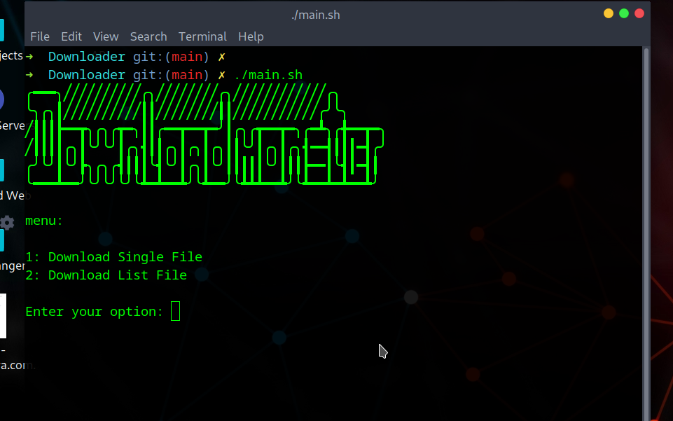

# Downloader

A small and simple downloader that allows you to download your files into Linux using the wget tool.

# Capabilities
+ Download single links
+ Download multiple links (just put your links in order in the link.txt file so that they all get downloaded)
+ Ability to add a counter at the end of your downloaded file names

## Usage

```bash
./main.sh
```

## Contributing

I would be happy if you could share your ideas to improve the project with me (using the contact information in my GitHub profile).


[]
